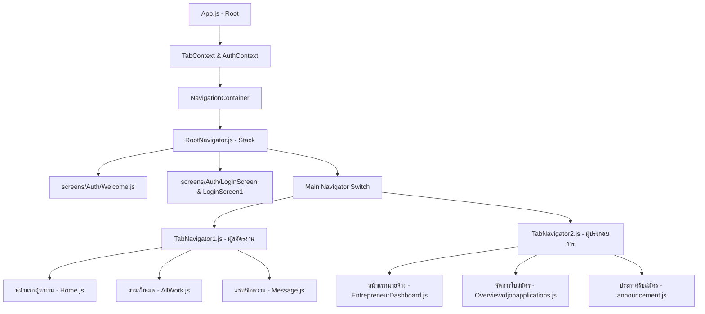

# KoratLink - Job Search Application

**KoratLink** เป็นแอปพลิเคชันมือถือที่ถูกพัฒนาขึ้นเพื่อแก้ไขปัญหาและปฏิรูปตลาดแรงงานท้องถิ่นในจังหวัดนครราชสีมา (โคราช) โดยสร้างขึ้นเพื่อให้เป็นสื่อกลางเชื่อมต่ออย่างสมบูรณ์แบบระหว่าง **"ผู้หางาน (Job Seeker)"** และ **"ผู้ประกอบการ/นายจ้าง (Employer/Entrepreneur)"** ให้สามารถเข้าถึงข้อมูล สมัครงาน และตอบรับการจ้างงานได้อย่างสะดวกรวดเร็ว ปลอดภัย และมีความน่าเชื่อถือสูง

แอปพลิเคชันนี้ผ่านการวิจัยและพัฒนาผ่านกระบวนการ **Design Thinking** ร่วมกับผู้ใช้งานจริงในพื้นที่ เพื่อออกแบบประสบการณ์การใช้งาน (UX) และหน้าจอสอดประสานการทำงาน (UI) ที่เป็นมิตรและเหมาะสมกับผู้ใช้ทุกกลุ่มวัยอย่างแท้จริง

---

## 🚀 วิธีการติดตั้งและเริ่มใช้งาน (Getting Started)

แอปพลิเคชันนี้พัฒนาด้วย **React Native** และครอบคลุมด้วยเครื่องมือ **Expo SDK 51** ซึ่งมีประสิทธิภาพสูงและรันได้บนทุกแพลตฟอร์ม (Android / iOS / Web)

### 1. ติดตั้ง Dependencies ของโปรเจกต์
เปิด Terminal ในโฟลเดอร์โปรเจกต์แล้วรันคำสั่งด้านล่างเพื่อติดตั้งไลบรารีทั้งหมด:
```bash
npm install
```

### 2. เริ่มต้นรันเซิร์ฟเวอร์นักพัฒนา (Expo Dev Server)
รันแอปพลิเคชันพร้อมกับทำความสะอาดแคชระบบ เพื่อให้บันด์เลอร์ประมวลผลโค้ดเวอร์ชันล่าสุด:
```bash
npx expo start --clear
```

### 3. เปิดทดสอบบนอุปกรณ์ของคุณ
* **สำหรับโทรศัพท์มือถือ (Android/iOS)**: ติดตั้งแอป **Expo Go** บนมือถือของคุณ จากนั้นใช้กล้องสแกน QR Code ที่แสดงบนเทอร์มินัล
* **สำหรับ Android Emulator หรือ iOS Simulator**: กดปุ่ม `a` หรือ `i` บนคีย์บอร์ดเพื่อเปิดทดสอบผ่านอีมูเลเตอร์โดยตรง

---

## 🔑 บัญชีสำหรับการทดสอบแอปพลิเคชัน (Test Login Credentials)

เพื่อความสะดวกรวดเร็วในการทดสอบฟังก์ชันต่างๆ ทางทีมพัฒนาได้จัดทำ **บัญชีจำลองระดับสากล** ไว้ให้คุณสามารถทดสอบได้ทันที ทั้งสองบทบาทผู้ใช้งาน:

### 🧑‍💼 1. บัญชีสำหรับทดสอบบทบาท "ผู้หางาน (Job Seeker)"
ใช้สำหรับล็อกอินเข้าสู่ฝั่งผู้สมัครงานเพื่อค้นหาตำแหน่งงาน, สร้าง Resume, ยื่นสมัครงาน และติดตามความคืบหน้า:
* **รหัสผ่านด่วนพิเศษ (สำหรับผู้พัฒนา)**:
  * **ชื่อผู้ใช้ (Username/Email)**: `1`
  * **รหัสผ่าน (Password)**: `1`
* **บัญชีทดสอบมาตรฐาน**:
  * **ชื่อผู้ใช้ (Username/Email)**: `user01`
  * **รหัสผ่าน (Password)**: `123456878Milk`
  * *(หรือใช้ชื่อผู้ใช้ `user02` รหัสผ่าน `Password123`)*

### 🏢 2. บัญชีสำหรับทดสอบบทบาท "ผู้ประกอบการ/นายจ้าง (Employer)"
ใช้สำหรับล็อกอินเข้าสู่ระบบประกาศงานของนายจ้างเพื่อลงประกาศรับสมัคร, จัดการสัมภาษณ์, ตรวจสอบใบสมัครงาน และซื้อบริการโปรโมทโฆษณา:
* **รหัสผ่านด่วนพิเศษ (สำหรับผู้พัฒนา)**:
  * **ชื่อผู้ใช้ (Username/Email)**: `1`
  * **รหัสผ่าน (Password)**: `1`
* **บัญชีทดสอบมาตรฐาน**:
  * **ชื่อผู้ใช้ (Username/Email)**: `user01`
  * **รหัสผ่าน (Password)**: `123456878Milk`

*💡 **หมายเหตุ**: ระบบใช้การระบุสิทธิ์โดยอิงจากปุ่มบทบาทที่คุณเลือกหน้า Welcome ก่อนเข้าสู่หน้าล็อกอิน*

---

## 💾 ระบบการจัดเก็บฐานข้อมูลของแอปพลิเคชัน (Database & Data Flow)

สำหรับผู้ที่ไม่มีความเชี่ยวชาญด้านระบบฐานข้อมูลคลาวด์ ข้อดีอันโดดเด่นของโปรเจกต์แอปพลิเคชันต้นแบบนี้คือ **"ระบบการจัดเก็บฐานข้อมูลภายในตัวโค้ดโดยตรง (In-Memory / Client-Side Mock Database)"**

### ❓ ระบบฐานข้อมูลแบบนี้คืออะไร?
* **ไม่มีการเชื่อมโยงระบบภายนอกที่มีค่าใช้จ่าย**: แอปพลิเคชันไม่ได้ผูกมัดหรือดึงข้อมูลผ่านระบบฐานข้อมูลคลาวด์ราคาแพงอย่างเช่น iCloud, Firebase, MongoDB, หรือ AWS ในขณะนี้
* **ข้อมูลทั้งหมดอยู่ในซอร์สโค้ด**: ข้อมูลประกาศรับสมัครงาน, รายการบริษัท, ข้อมูลจำลองผู้สมัคร รวมถึงรหัสผ่านสำหรับล็อกอินทั้งหมด ถูกจัดเก็บในรูปแบบตัวแปรของภาษา JavaScript (เช่น อาร์เรย์ของวัตถุ `users` หรือ `options1`) ที่ฝังอยู่โดยตรงในแต่ละหน้าจอและ Context
* **การส่งต่อข้อมูลข้ามหน้าจอ (State Management)**: ข้อมูลสำคัญที่ต้องแชร์ข้ามหน้าจอ (เช่น ข้อมูลล็อกอิน หรือการกดเปลี่ยนแท็บ) จะไหลผ่านตัวกระจายข้อมูลส่วนกลางที่เรียกว่า **React Context Providers** (`AuthContext.js`, `TabContext.js`, และ `TabBarContext.js`)

### 👍 ข้อดีของสถาปัตยกรรมแบบนี้สำหรับการทดสอบ:
1. **รันได้ทุกที่ทุกเวลา**: คุณสามารถเปิดรันแอปพลิเคชันเพื่อทดสอบได้แม้อยู่ในโหมดออฟไลน์ (ไม่มีอินเทอร์เน็ต) หรือรันบนเครื่องคอมพิวเตอร์เครื่องใดก็ได้ทันทีโดยไม่ต้องตั้งค่าระบบฐานข้อมูลที่ซับซ้อน
2. **ปลอดภัยและล้างข้อมูลได้ง่าย**: เมื่อเกิดความผิดพลาดใดๆ ระหว่างทดสอบกรอกข้อมูล หรือต้องการกลับสู่ค่าเริ่มต้น เพียงแค่ปิดแอปพลิเคชันแล้วเปิดขึ้นมารันใหม่ ข้อมูลทั้งหมดก็จะกลับคืนสู่สถานะเดิมที่สมบูรณ์ทันที
3. **เหมาะสมที่สุดสำหรับงานนำเสนอต้นแบบ (Prototype Pitching)**: ช่วยตัดความเสี่ยงเรื่องอินเทอร์เน็ตล่ม, บัญชีคลาวด์หมดอายุ หรือ API ขัดข้องระหว่างการสาธิตการใช้งาน (Demo)

---

## 🛠️ โครงสร้างระบบการนำทางใหม่ (Restructured Navigation)

เพื่อทำให้โค้ดสั้นลง อ่านง่าย และบำรุงรักษาง่ายขึ้นมหาศาล แอปพลิเคชันได้รับการจัดโครงสร้างระบบนำทาง (Navigation Layout) ออกเป็นสัดส่วนที่ชัดเจนภายใต้โฟลเดอร์ `navigation/` ดังนี้:



* **`App.js`**: เหลือโค้ดเพียง 110 บรรทัด ทำหน้าที่คลีนๆ เป็นผู้โฮสต์ Context และหุ้ม Root Navigation เท่านั้น
* **`navigation/RootNavigator.js`**: ศูนย์รวมหน้าจอทั้งหมด (Stack.Navigator) ของแอป เพื่อควบคุมเส้นทางการเปิดหน้าจอย่อยกว่า 40+ หน้าจอ
* **`navigation/TabNavigator1.js`**: ตัวควบคุมแถบเมนูด้านล่าง (Bottom Tab) สำหรับฝั่งผู้หางาน
* **`navigation/TabNavigator2.js`**: ตัวควบคุมแถบเมนูด้านล่าง (Bottom Tab) สำหรับฝั่งผู้ประกอบการ/นายจ้าง

---

## ✨ ทีมผู้พัฒนาและวัตถุประสงค์เพื่อสังคม

แอปพลิเคชันนี้ออกแบบและสร้างสรรค์ขึ้นโดยเน้นการยกระดับคุณภาพชีวิตชุมชนในโคราช มุ่งเน้นการสร้างโอกาสทางอาชีพ ลดอัตราการว่างงานในพื้นที่ และเชื่อมโยงเศรษฐกิจท้องถิ่นให้ก้าวหน้าไปพร้อมกับนวัตกรรมดิจิทัลยุคใหม่ 🏢🤝
